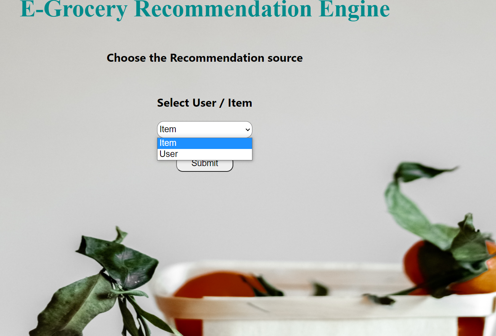
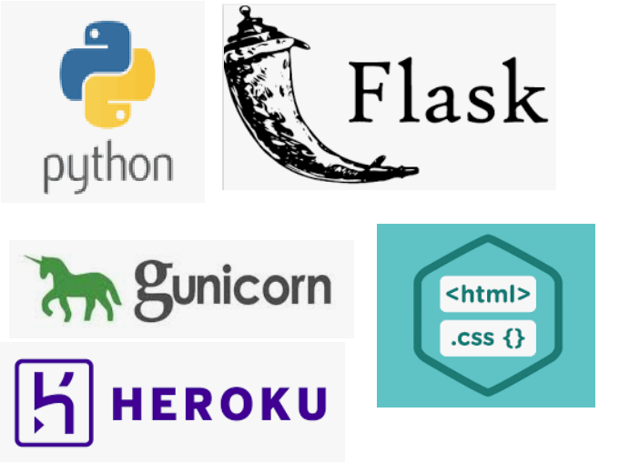

link : https://e-groceryrecommendationeng.herokuapp.com/

## Motivation
This Project is initiated to help e-grocery stores, owing to the increase in Online sales due to covid. Amazon and netflix recommendation systems are amazing and keeps us engaged
while shopping or browsing. This project is a small initiative to understand and reflect all the hardwork behind those.. ' Items you may like..', 'Movies recommended for you..'.!

## Goal 
The Goal of the project is to engage customer on the app and increase the no. of conversions by giving the appropriate recommendations

## Technologies Used 

